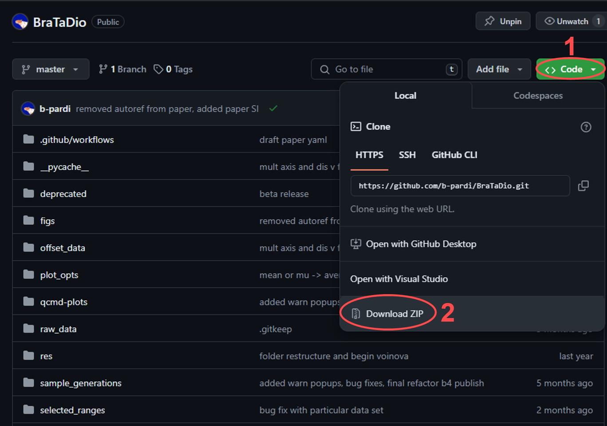

# py-QCM-BraTaDio README

## Statement of Need

QCM-D has gained popularity in many different scientific fields due to its experimental simplicity and versatility. QCM-D (or just QCM if not quantifying energy losses) can be combined with a variety of instruments for in situ complementary measurements, such as atomic force microscopy (AFM),[@Friedt:2003] microtribometry,[@Borovsky:2019] surface plasmon resonance (SPR),[@Bailey:2002] or electrochemistry,[@Levi:2016] among others. However, one drawback rests in that any QCM-D experiment, real-time monitoring of sensor surface-environment generates large volumes of data entries, and packages used to collect data do not typically possess straightforward data visualization, data mining capabilities, and basic model applications. Furthermore, programs associated with QCM-D data collection and analysis are often proprietary with limited access. There exists other open-source packages, such as RheoQCM[@Shull:2020] and pyQTM[@Johannsmann:2023], however, they focus on more complex data modeling rather than data mining. `pyQCM-BraTaDio` can serve as a complement to these two packages Here, we present an intuitive Python-based, open-source software that is QCM-D manufacturer agnostic of multi-harmonic collecting systems for (1) simple and fast data visualization and interaction, (2) data mining and reduction, and (3) basic model applications. The supported models include (i) Sauerbrey, for rigid thin films, (ii) viscoelastic thin film in a Newtonian liquid, (iii) viscoelastic thin film in air, and (iv) quartz crystal thickness determination. 

Please continue below for instructions on using the software.

## Video Demo

## Important Notes before Starting
### This software was designed and tested in a WINDOWS environment
- If using Mac or Linux, please be aware that issues may occur
- Create a new issue in git if there is an incompatibility

### The only verified Python version this software has been fully tested on is 3.10.x
- Others will likely work, but cannot be verified at this time

### This software is capable of reading RAW QSENSE files (*.qsd)
- Simply select your data file and select QSense device, proceeding as follows in the 'File Information' Section

### 'sample_generations' folder contains sample data to test with software, as well as figures output by that sample data

### Clicking submit after giving required information to the UI will generate a variable number of plots based on what analysis is desired

### IF USING SPYDER
- By default, plt will show plots in console box and span selector will not work.
- Follow these steps to make selection plots open in new window:
Tools > Preferences > IPython console > Graphics > Graphics Backend > Apply & OK.

## Getting Started
There are two methods for downloading the package.
### For developers or those who may want to contribute in some fashion
- Clone the repository into a directory of your choosing
	- In a terminal, create or navigate to the folder you want to download the code to
	- Run the command `git clone https://github.com/b-pardi/BraTaDio.git`
	- You should now have all the required files
### For those without programming experience that simply want to use the software
- Download the zip file
	- In the webpage for this repository, click the button that says 'code' (1)
	- At the bottom of the drop down, click the 'Download ZIP' button (2)
	- Extract the zip file to a folder of your choice

### Once downloaded, the remaining steps apply to both cases
- In a terminal, make sure you are in the parent directory of the code
	- Your current path should look like: `C:\path\to\directory\BraTaDio` with the key component being that the directory ends with 'BraTaDio'
	- If not, use the `cd` command to navigate to the directory
		- If you cloned the repository, you only need to move one directory: `cd BraTaDio`
		- If you extracted the ZIP file, use your file explorer to find the code you extracted and enter the BraTaDio folder
		- Then copy the folder path
		- In a terminal, type: `cd "<paste your path here>"` ensuring you have the quotes
	- **Note for Spyder**: you can open a terminal by going to `menu > View > Panes > Terminal`
- Setup virtual environment (optional but reccommended)
	- Create the virtual environment: `python -m venv .venv`
	- Activate it
		- Windows: `.venv\Scripts\activate`
		- Mac/Linux: `source .venv/bin/activate`
	- You can also use conda if preferred
- Install package dependencies
	- Install with pip using the requirements file: `pip install -r requirements.txt`
	- If you get an error with this command in Spyder,
		- Have python 3.10.x installed on your computer (not via spyder, from https://www.python.org/downloads/)
		- In a command prompt, (not anaconda terminal) type 'where python' on windows, or in a mac terminal type 'which python'
		- Copy and paste the full path that it prints out
			- On windows it should look something like: 'C:\<some path stuff>\Python\Python310\python.exe'
			- In spider, go to tools > preferences > python interpreter
			- Select 'Use the following Python interpreter:'
			- Paste in the path you copied earlier from the terminal
			- Click apply and ok, and restart spyder for changes to take effect
- Run main.py to get started
	- **NOTE** main.py is the ONLY python file that should ever be executed. The other scripts are dependend on main.py for UI inputs.

### Figure 1 - pyQCM-BraTaDio UI for reference
(1) Initialization conditions, (2) selection of frequencies and dissipation for data mining, visualization, and modeling, (3) interactive plotting options for data range selection, and (4) selection of plotting options and modeling.

## File Information (1)
- To select the data file to analyze, simply click the select data file button.
- This will open your machine's file explorer window to select the file.
- By default it will show the 'raw_data' folder in the program directory, however you can select a file anywhere on your computer.
- Once file is selected, specify which of the 4 supported experimental devices your data came from.
	- These devices include Open QCM-Next, QCM-I, QSense, and AWSensors
	- The program will convert the data file to a consistent format used by the remainder of program's execution.
	-  **Do Not** alter the column names of the data file the experimental device outputs, as the formatting routine relies on the default output the device for reformatting.
	- Once formatting is done, there will be a file saved in the raw_data directory that the software will read, prepending 'Formatted-' to the original name of your data file.
	-  **Do Not** alter this file either.
- Depending on which source selected, there will be a prompt to either enter absolute or relative baseline time.
	- This refers to the equilibrium time used to shift the data by.
	- For testing purposes, it is appropriate to enter 0-100 (in seconds) as a sample baseline time.
	- In practice, this should be the last x number of seconds where the frequency is stable before the experiment begins.
- Next is to specify theoretical or calibration values for calculations in the modeling section.
	- If user selects theoretical, it will use theoretical peak frequency values and theoretical mass sensitivity constant, C = -17.7 ng/(Hz*cm^2) for Sauerbrey model.
	- If user selects calibration, there is the prompt to either:
		- Copy/paste offset values into a file 'offset_data/COPY-PASTE_CALIBRATION_DATA_HERE.csv'
			- There are populated values in this value already for demonstrative purposes.
		- OR click a button 'Enter values here' and enter the values into the software directly
		- **Important note** these values are only necessary for QSense and AWSensors, however these are not required if using QSense with a raw *.qsd file
- **Once all information is entered, user can then click 'Submit File Information'.**

- **NOTE** if you are using QSense or AWSensors and do not have the calibration values for your experiment, you are limited to just visualization, no modeling features will work correctly due to the nature of how QSense only records the change in frequency, not the actual values.
- **NOTE** if you are using QCM-I or Open QCM-Next, upon selecting 'offset' a label popups up to notify you that entering these values is unnecessary, as these devices record information that QSense and AWSensors do not, so the offset is found computationally.

## Plot Customization (1.1)

- At the bottom of the data file column, there is a 'customize plot options button', Here you can specify the following:
	- Font type.
	- Various font sizes.
	- Tick direction.
	- Scale of time
	- Saved figure file format.
	- Saved figure DPI (Dots Per Inch)
		- This corresponds to quality, default is 200
	- Index of points to plot.
		- i.e. every 5th point.
	- Bounds of axis for visualization plots
		- Time bounds are in units that are selected for time scale above
		- Frequency bounds are in terms of DELTA f, not f
		- Dissipation bounds are (your number) * E-6
	- Colors of each overtone.
- When selections are confirmed, they are saved for all future executions of the program.
- There is also the option to load default values.
- If selections are confirmed and there are entries not selected, values previously saved will be used.
- **Note** The default font used is 'Arial'. If your system does not have this font, you can specify a generic font family in the font type entry of this window
	- i.e. put 'sans serif' or 'serif' in the the font type section, (without the quotes)
  

## Overtone Selections (2)

- The middle 2 columns offer the user to plot the raw data for any overtone desired, as well as the reference level adjusted data.
- In addition to selecting the overtones this is also where you select to plot the interactive plot, either for raw or reference level adjusted data.
	- Interactive plot details in later section
- **NOTE** all plot options and modeling features require reference level adjusted data, raw data's only purpose is visualization, it is not used for anything other than just being plotted.
- It is at this point having filled out the file information columnm, and selecting which overtones you'd like to plot, that you have given the software the minimum amount of information to generate plots. Continue below for more plots and analysis that can be done.

## Plot options (4)

### Figure 2 - various plot options provided by pyQCM-BraTaDio

- Users have the following options for plots beyond basic visualization:
	- Change in frequency as a function of time (plotted by default), Figure 2a.
	- Normalized change in frequency as a function of time, Figure 2b.
	- Change in Dissipation as a function of time (plotted by default), Figure 2c.
	- Multi-axis change in frequency and dissipation as a function of time, Figure 2d.
	- Multi-axis normalized change in frequency and dissipation as a function of time, Figure 2e.
	- Temperature as a function of time, Figure 2f.
	- Change in dissipation as a function of change in frequency, Figure 2g.
	- Change in dissipation as a function of normalized change in frequency, Figure 2h.
	
		- **NOTE**, when selecting normalization, all plots in this section are normalized, however interactive plot and all modeling plots will NOT be normalized unless the model dictates so.
		- All plots that are normalized will indicate on the y axis reading (Df/n).

- Additional options include:
	- Drift correction.
			- Finds slope (drift) of baseline, and rotates all points by the amount required to flatten the baseline.
	- Interactive plot (further detailed below).
	- Modeling/further analysis (further detailed below).  

## Interactive Plot (3)

### Figure 3.1 - UI prompting for interactive plot
Activating the interactive plot option requires to select an overtone and assign a label or identifier for data mining.

- When checking the interactive plot box, an entry field appears to enter which overtone you would like to visualize in the plot. Enter the number of the overtone to display the data for in the plot.

	- **NOTE** that the overtone you select to visualize does not effect the output of any plots or analysis, as the software acts on selections made in the plot to ALL overtones in that range.
	- We visualize just 1 overtone in this plot to make it look cleaner and give the user and easier time making selections.
	- For whichever overtone is to be analyzed in the interactive plot, ensure that that overtone is selected in the baseline corrected data section as well, as it relies on the cleaned data processing done there.
- Before making any selections, make sure you have selected a range identifier.
	- This identifier typically will correspond to what was done in the experiment to produce the specific range of data to be selected.
	- However, the identifier is arbitrary, and is for your reference. The software uses this later when saving calculations and displaying plots for your reference.
	- Once the identifier is entered, click 'Confirm range' to update the software of the identifier for the data you are about to select.
	-  **NOTE** selections will overwrite data of the same identifier, but will NOT overwrite selections from different identifiers.
	- i.e. if you select data for range 'x' in file 'data1.csv', but a selection for that was already made and data is already there, even if there are other ranges in the file, only data for range 'x' file 'data1.csv' will be overwritten, and data for range 'y' in 'data1.csv' and range 'x' in 'data2.csv' will remain untouched.
	- This means if you make an erroneous selection, you can simply make another one and correct it, and you can also make multiple selections from the same data using different identifiers for each selection.

### Figure 3.2 - Interactive plot
(a) Input line for time range selection, (b) change in frequency interactive plot, (c) zoomed-in region from the change in frequency interactive plot and frequency drift, (d) change in dissipation interactive plot, and (e) zoomed-in region from the change in dissipation interactive plot and dissipation drift.

- Selections are made by clicking and dragging anywhere in plots (b) or (d), or inputting the x values into the text field above (a) in the form of XMIN,XMAX and hitting enter.
	- All 3 of these are grouped. i.e. if you make a selection in one, it'll update the other two with that selection
- Selected range is zoomed in and displayed in right side of figure (c) and (e), and all basic statistical calculations on the selections are save into csv files in the 'selected_ranges' folder.
- A linear regression will be done on the zoomed data as well to indicate the drift.
- **NOTE**, if you normalized your data via one of the options being selected, this data will NOT be normalized for the sake of modeling functions used after.
	- if you opted to correct the slope however, this option WILL be applied.

## Modelling Window (4)

### Modeling Window is only relevant if the interactive plot is selected and selections have been made *ex ante*.
- Once all desired selections in the interactive plot are made, the user can choose from any of the available modelling/further analysis options to apply models to the selected data, by clicking the 'Modelling' button.
- Available model application options include:
	- Plotting average delta f and delta D of each overtone.
	- Sauerbrey mass.
	- Thin film in liquid.
	- Thin film in air.
	- Crystal Thickness.
		- Contrary to above model applications, crystal thickness relies on offset data, not interactive plot selections. 
- All models except crystal thickness rely on selectiong in the interactive plot.
- These plots are saved to qcmd-plots/modeling.

 - **NOTE** while you can make multiple selections from multiple data files and have them all saved without overwriting, it is *highly* recommended to 'Clear saved range data' between experiments, as the modelling functions will not work correctly across multiple files.  

## Errors / FAQ

Known errors (originating from erroneous user input) will be displayed in a popup window when encountered. The software does not close when this occurs, and the user is able to correct the error and resume processing. Here are some frequently encountered errors and how to remedy them.

- ShapeMismatchException: This occurs when the software tries to apply a model to the interactive plot selection but there are a different number of overtones found in the selection data than there are selected in the UI
	- Solution 1: Make sure the overtones selected in the ui match the overtones that were selected in the interactive selection was made.
	- Solution 2: Sometimes data from a previous experiment's interactive plot selection can interfere with a new one. It's best practive to always click the 'Clear saved ranges' button before making interactive plot selection for a new experiment. This will prevent conflicts of overtone data with other experiments.
	- Solution 3 (Using crystal thickness model): Unlike all the other models, crystal thickness uses the RAW overtone selection, so make sure the overtones you want to analyze the crystal thickness of, are selected in the raw data overtones column.

# Testing

## Automated Testing
**Warning:** Before testing, make sure any data and plots are saved elsewhere, as tests will overwrite data/plots.

3 test scripts are available. To run them, ensure you have pytest and pillow installed first: `pip install pytest==8.1.1 pillow==10.3.0`. Pillow is used for checking plot generations against verified sample plots.
To test the suite, from the BraTaDio root directory use: `pytest src/test/`.

## Manual Testing

To ensure the software is functioning correctly, please follow the manual testing instructions below.

### Functionality Testing

1. **Open the Application:**
	- Run main.py script to open the Tkinter window.
	- Ensure the window opens without errors.
	- Ensure all checkboxes and radio buttons are selectable.

2. **File Formatting:**
	- Click the "Select File" button.
	- Use the file dialog to select a QCM-D data file.
	- Verify that the selected file path is displayed in the UI.
	- Inputting file information outlined in "File Information (1)".
	- Click 'Submit file information'.
	- Ensure there is a label that briefly appears just below the 'Clear entries' button (will remain for 5 seconds and disappear).
	- Verify that there is a csv file in the 'raw_data' folder called 'Formatted-<your-original-filename>.csv.

3. **Basic Visualizations:**
	- Ensure file information is already filled out and the 'Submit file information' has been clicked.
		- If file formatting isn't working this test won't work either.
	- Select the top middle checboxes for 'Raw Data Overtone Selection' and 'Shifted Data Overtone Selection'.
	- Select any number of overtones in each category.
	- Click 'Submit' in the fourth column.
	- Verify 4 plots generated in the 'qcmd-plots' folder.
		- These should be:
		- 'dissipation_plot' figure 2c
		- 'frequency_plot' figure 2a
		- 'RAW-dissipation_plot'
		- 'RAW-frequency_plot'
	- The raw figures should look like nearly horizontal lines
	- Ensure that the overtones selected in the UI correspond to the overtones plotted in the figures generated

4. **Analysis Options:**
	- With file information filled out and submitted, and overtones selected, select (one at a time) options for plots in the 4th column and verify results. The options are as follows:
	- 'Plot ${\Delta}f$ and ${\Delta}D$ together' should generated a multiaxis plot of the shifted data. The data should look similar to the individual plots shown in the previous test, just plotted together. The file is called: 'freq_dis_V_time' shown in figure 2d.
	- 'Plot ${\Delta}D$ vs ${\Delta}f$' should generate a plot of change in dissipation on the y axis, and change in frequency on the x axis showin in figure 2g.
	- 'Plot temperature vs time' will generate a plot with temperature on the y axis, and time on the x axis called 'temp_vs_time_plot' shown in figure 2f.
	- 'Normalize ${\Delta}f$ with its respective overtone can be selected along with any other or no other options, it will output plots with the same file names, but any plots with frequency, the axis will now have '${\Delta}f_n/n$' as opposed to just '${\Delta}f_n$'.
	- Interactive plot is more extensive and will be discussed in the next section.

5. **Interactive Plot and Modelling:**
	- Ensure file options are filled (selecting offset peak frequency values) and submitted, uncheck the 'Raw data overtone selection', select ALL overtones in the shifted data section, and uncheck all analysis options before proceeding.
	- Select the radio button for 'Interactive plot' at the bottom of the Shifted data column.
	- Input a number indicating which overtone will be visualized in the first text field that just displayed. This is any number selected in the checkboxes, however in practive typically 3 or 5 are chosen as they have the least noise/variation experimentally.
	- Enter a range identifier in the next box. This can be any string of your choosing. 'test', for example.
	- Click confirm range.
	- Select the checkbox 'Enable interactive plot' in the far right column.
	- Click 'Clear saved range data' in the far right column
	- Click submit in the far right column.
	- Verify a new window opens with a 2x2 grid of plots.
	- Click and drag anywhere in either of the left 2 plots.
	- Verify that if a selection is made in the top left, that the bottom left plot automatically updates to match the selection made, and vice versa.
	- Verify the right 2 plots update, showing a zoomed in plot of the selection just made, as well as a linear regression fit indicating the 'drift' of the data in the selections.
	- Verify 'clean_all_stats_rf.csv' and 'clean_all_stats_dis.csv' in the 'selected_ranges' folder were updated upon selection.
	- Select a small portion of the end of the data (as similar as possible to figure 3.2)
	- Close the plot window and click the 'Modelling' button in the far right column.
	- Ensure a new small window opens with various models to apply to the selection just made.
	- Click the 'Plot average ${\Delta}f$ and ${\Delta}D$.
	- Verify two plots generated with the range identifier from earlier in the file name: 'Avg_Dd_range_<test_label>', 'Avg_Df_range_<test_label>'. These plots should show the average change in dissipation and change in frequency values (respectively) of each overtone.
	- Click the 'Run Sauerbrey mass analysis'.
	- Verify two plots generated, one plotting average Sauerbrey mass for each overtone ('Sauerbrey_avgs_range_<test_label>'), and one with a linear fit of the average change in frequency of each overtone, reporing the found mass in the plot legend (Sauerbrey_fit_range_<test_label>).
	- Click the 'Run analysis of thin film in liquid' button.
	- Verify a plot generated named 'thin_film_liquid_<test_label>', with a linear fit reporting shear dependent compliance.
	- Click the 'Run analysis of thin film in air' button.
	- Verify 2 plots generated 'thin_film_air_FREQ_<test_label>' 'thin_film_air_GAMMA_<test_label>'. They should each show linear fits, they will not make much sense with the experimental data in the sample generations folder, as this model is for different experimental data. However for the purposes of testing, we simply want to verify the plot generates.
	- Back in the main UI window, select 'Raw Data Overtone Selection' and select all overtones in that column.
	- In the modelling window, click the 'Run crystal thickness' button.
	- Verify a plot file is generated named 'crystal_thickness' that reports the thickness of the crystal used to attain this data in the plot legend.

### Usability Testing

1. **UI Layout:**
	- Check that all UI elements (buttons, sliders, input fields) are properly aligned and accessible (see figure 1 for reference).
		- Note that some options are only visibile when other options are checked, ensure all the check/radio buttons in your UI match figure 1
	- Ensure the 'Customize plot options' button and 'Modelling' button open new windows.

2. **Error Messages:**
	- Trigger common errors (e.g., clicking 'submit file information' before selecting a data file) and verify that appropriate error messages are displayed.

### Checklist

- [ ] Open the application without errors.
- [ ] Check various boxes and select various radio buttons without issue.
- [ ] Select a QCM-D data file and have it show the filename in the UI.
- [ ] Successfully format a data file.
- [ ] Generate the four basic visualization plots
- [ ] Perform and verify all analysis options.
- [ ] Generate and display the interactive plot.
- [ ] Make selections and have all facets of the plot update accordingly (including selected data csv files).
- [ ] Plot all the available model applications successfully.
- [ ] Verify UI layout and button functionality.
- [ ] Check error messages for common errors.

Please report any issues or unexpected behavior during the testing process.

------------------------------
